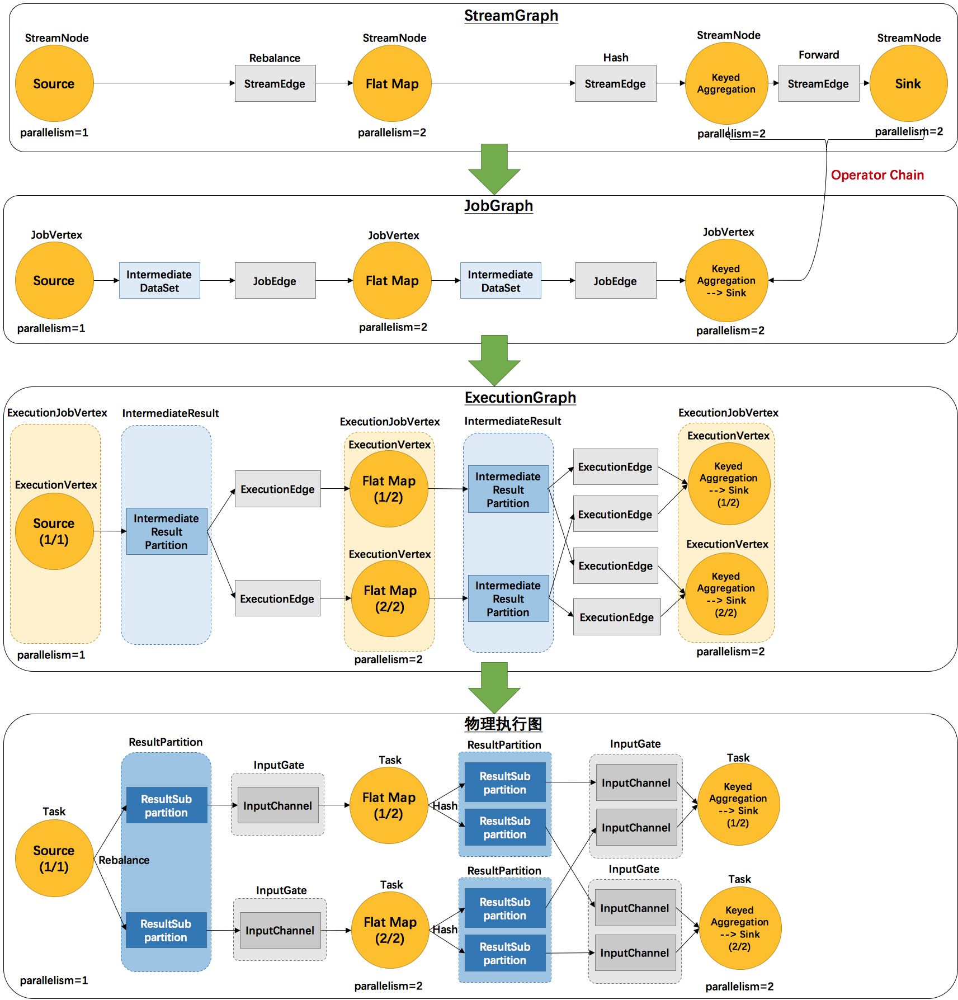
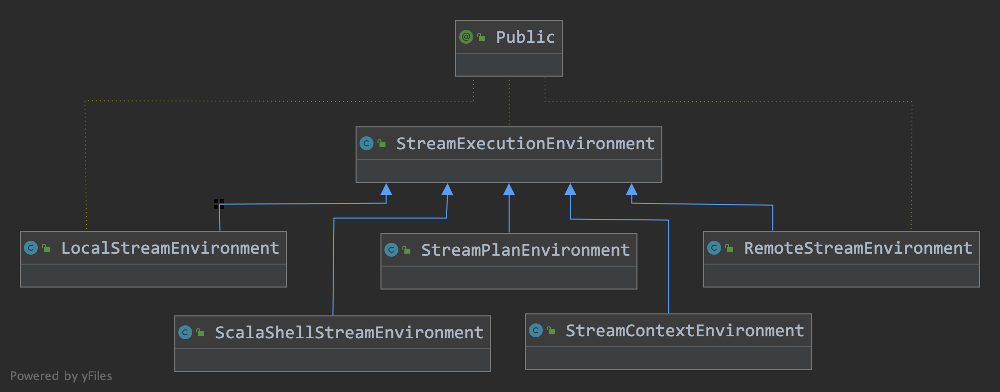
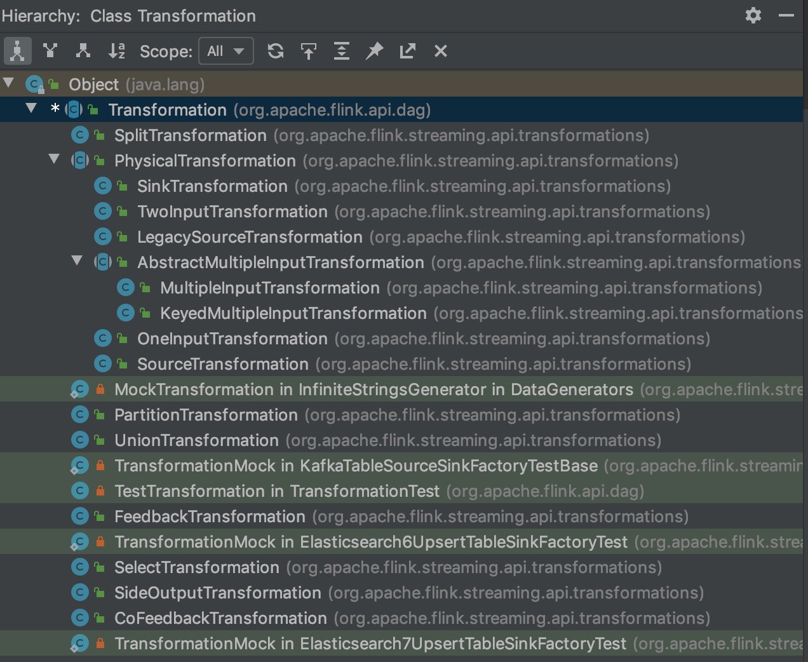

# 从一个例子看 Flink 程序是如何跑起来的

## 1. 四层执行图

在阅读 Flink 文档的过程中，很多地方都能看到如下这个图，也就是 Flink 的四层执行图，如下。




其实这个图里面少了一层用户代码层，如果插入到图中，应该在最上层。

- **StreamGraph：** 用户代码生成的 Dataflow 拓扑结构图，类似 Spark 的 DAG 图。
- **JobGraph：** StreamGraph 只是最初的图，经过一系列的优化会生成了 JobGraph，JobGraph 是可以提交给 JobManager 直接运行的。实际上要运行一个 Flink 程序，除了提交给 JobManager 的  JobGraph，还需要将所以依赖的 Jar 文件一并提交。StreamGraph 到 JobGraph 的转换过程中会做一系列的优化工作，比如将多个 operator 合并为一个，也就是常说的 chain。
- **ExecutionGraph：**ExecutionGraph，顾名思义，执行图。是根据 JobGraph 生成的分布式执行图。
- **物理执行图：**JobManager 根据 ExecutionGraph 对 Job 进行调度后，在各个TaskManager 上部署 Task 后形成的“图”，并不是一个具体的数据结构。


就像我们学一门编程语言先写我们的 HelloWorld 程序一样，学一个新的分布式计算框架我们一般都是以 WordCount 来开始。下面我们就以 Flink 中的示例 WordCount 程序开始来看 Flink 程序是如何跑起来的。


## 2. example code

示例代码在 Flink 源码的 ***flink-examples*** 模块下。代码路径为 `flink-examples/flink-examples-streaming/src/main/java/org/apache/flink/streaming/examples/wordcount/WordCount.java`。全部代码我们就不贴了，下面我们看一下核心逻辑。
```java
public static void main(String[] args) throws Exception {
		// Checking input parameters
		final MultipleParameterTool params = MultipleParameterTool.fromArgs(args);

		// set up the execution environment
		final StreamExecutionEnvironment env = StreamExecutionEnvironment.getExecutionEnvironment();

		// make parameters available in the web interface
		env.getConfig().setGlobalJobParameters(params);

		// get input data
		DataStream<String> text = null;
		if (params.has("input")) {
			// union all the inputs from text files
			for (String input : params.getMultiParameterRequired("input")) {
				if (text == null) {
					text = env.readTextFile(input);
				} else {
					text = text.union(env.readTextFile(input));
				}
			}
			Preconditions.checkNotNull(text, "Input DataStream should not be null.");
		} else {
			System.out.println("Executing WordCount example with default input data set.");
			System.out.println("Use --input to specify file input.");
			// get default test text data
			text = env.fromElements(WordCountData.WORDS);
		}

		DataStream<Tuple2<String, Integer>> counts =
			// split up the lines in pairs (2-tuples) containing: (word,1)
			text.flatMap(new Tokenizer())
			// group by the tuple field "0" and sum up tuple field "1"
			.keyBy(0).sum(1);

		// emit result
		if (params.has("output")) {
			counts.writeAsText(params.get("output"));
		} else {
			System.out.println("Printing result to stdout. Use --output to specify output path.");
			counts.print();
		}
		// execute program
		env.execute("Streaming WordCount");
	}
```


## 3. StreamExecutionEnvironment

代码里面首先初始化了一个 StreamExecutionEnvironment，这个 Class 是用来表示一个流式作业的上下文信息。




StreamExecutionEnvironment 有五个主要的派生类：

* LocalStreamEnvironment：local 运行模式的 context 信息

* RemoteStreamEnvironment：remote 可能听起来有点疑惑，其实这个就是 Flink 作业以集群模式运行的 context 信息

* StreamPlanEnvironment：这个是用来给用户想要生成 graph 时使用的，可以理解为工具类

* ScalaShellStreamEnvironment：在 scala shell 里面使用

* StreamContextEnvironment：一般是 client 调用使用


## 4. StreamGraph

在看 StreamGraph 的具体数据结构之前，我们先看一下第 2 部分的示例代码是如何转换成 StreamGraph 的。上面的 HelloWorld 的执行代码在 44 行，我们跟进去可以看到 execute 的逻辑非常简单:

* 先生成 StreamGraph: getStreamGraph
* 然后执行 execute

```java
public JobExecutionResult execute(String jobName) throws Exception {
		Preconditions.checkNotNull(jobName, "Streaming Job name should not be null.");

		return execute(getStreamGraph(jobName));
}
```


我们先看一下生成 StreamGraph 的逻辑，核心是下面代码中的 generate() 函数。

```java
@Internal
public StreamGraph getStreamGraph(String jobName) {
  return getStreamGraph(jobName, true);
}

public StreamGraph getStreamGraph(String jobName, boolean clearTransformations) {
  StreamGraph streamGraph = getStreamGraphGenerator().setJobName(jobName).generate();
  if (clearTransformations) {
    this.transformations.clear();
  }
  return streamGraph;
}

private StreamGraphGenerator getStreamGraphGenerator() {
  if (transformations.size() <= 0) {
    throw new IllegalStateException("No operators defined in streaming topology. Cannot execute.");
  }
  return new StreamGraphGenerator(transformations, config, checkpointCfg)
    .setStateBackend(defaultStateBackend)
    .setChaining(isChainingEnabled)
    .setUserArtifacts(cacheFile)
    .setTimeCharacteristic(timeCharacteristic)
    .setDefaultBufferTimeout(bufferTimeout);
}

public StreamGraph generate() {
  //进行一系列的配置
  streamGraph = new StreamGraph(executionConfig, checkpointConfig, savepointRestoreSettings);
  streamGraph.setStateBackend(stateBackend);
  streamGraph.setChaining(chaining);
  streamGraph.setScheduleMode(scheduleMode);
  streamGraph.setUserArtifacts(userArtifacts);
  streamGraph.setTimeCharacteristic(timeCharacteristic);
  streamGraph.setJobName(jobName);
  streamGraph.setGlobalDataExchangeMode(globalDataExchangeMode);

  alreadyTransformed = new HashMap<>();

  //转换核心逻辑
  for (Transformation<?> transformation: transformations) {
    transform(transformation);
  }

  final StreamGraph builtStreamGraph = streamGraph;

  alreadyTransformed.clear();
  alreadyTransformed = null;
  streamGraph = null;

  return builtStreamGraph;
}
```

generate 的核心是将所有的 transformation 进行转换，那么 transformation 是什么呢？从函数 getStreamGraphGenerator() 可以看出来 transformation 是从 StreamExecutionEnvironment 中得到的。StreamExecutionEnvironment 中的 transformation 涉及到的操作如下。而实际上 addOperator 这个方法正式 DataStream API 中进行调用，然后将 operator 添加到 Environment 中的。

```java
protected final List<Transformation<?>> transformations = new ArrayList<>();

@Internal
public void addOperator(Transformation<?> transformation) {
  Preconditions.checkNotNull(transformation, "transformation must not be null.");
  this.transformations.add(transformation);
}
```

我们简单看一下 Transformation 的介绍。

```java
/**
 * A {@code Transformation} represents the operation that creates a
 * DataStream. Every DataStream has an underlying
 * {@code Transformation} that is the origin of said DataStream.
 *
 * <p>API operations such as DataStream#map create
 * a tree of {@code Transformation}s underneath. When the stream program is to be executed
 * this graph is translated to a StreamGraph using StreamGraphGenerator.
 *
 * <p>A {@code Transformation} does not necessarily correspond to a physical operation
 * at runtime. Some operations are only logical concepts. Examples of this are union,
 * split/select data stream, partitioning.
 *
 * <p>The following graph of {@code Transformations}:
 * <pre>{@code
 *   Source              Source
 *      +                   +
 *      |                   |
 *      v                   v
 *  Rebalance          HashPartition
 *      +                   +
 *      |                   |
 *      |                   |
 *      +------>Union<------+
 *                +
 *                |
 *                v
 *              Split
 *                +
 *                |
 *                v
 *              Select
 *                +
 *                v
 *               Map
 *                +
 *                |
 *                v
 *              Sink
 * }</pre>
 *
 * <p>Would result in this graph of operations at runtime:
 * <pre>{@code
 *  Source              Source
 *    +                   +
 *    |                   |
 *    |                   |
 *    +------->Map<-------+
 *              +
 *              |
 *              v
 *             Sink
 * }</pre>
 *
 * <p>The information about partitioning, union, split/select end up being encoded in the edges
 * that connect the sources to the map operation.
 *
 * @param <T> The type of the elements that result from this {@code Transformation}
 */
```

简单来说 Transformation 就是 DataStream API （比如 map, filter 等）对应的底层 operation，但是并不是每个 Transformation 最后都会对应到一个物理的运行算子。

Tranformation 的种类包括如下几种，比如 SourceTransformation、SinkTransformation 等。




前面说完了 StreamGraph 的转换逻辑，我们简单看一下 StreamGraph 的 Class 结构。包含的一些成员信息如下：

* jobName：作业名称
* executionConfig：比如并行度等
* checkpointConfig：checkpoint 配置
* savepointRestoreSetting：savepoint 的配置
* scheduleMode：调度模式
* ...
* streamNode
* source
* sink
* ...

```java
/**
 * Class representing the streaming topology. It contains all the information
 * necessary to build the jobgraph for the execution.
 */
@Internal
public class StreamGraph implements Pipeline {
	public static final String ITERATION_SOURCE_NAME_PREFIX = "IterationSource";
	public static final String ITERATION_SINK_NAME_PREFIX = "IterationSink";
	private String jobName;
	private final ExecutionConfig executionConfig;
	private final CheckpointConfig checkpointConfig;
	private SavepointRestoreSettings savepointRestoreSettings = SavepointRestoreSettings.none();
	private ScheduleMode scheduleMode;
	private boolean chaining;
	private Collection<Tuple2<String, DistributedCache.DistributedCacheEntry>> userArtifacts;
	private TimeCharacteristic timeCharacteristic;
	private GlobalDataExchangeMode globalDataExchangeMode;

	/** Flag to indicate whether to put all vertices into the same slot sharing group by default. */
	private boolean allVerticesInSameSlotSharingGroupByDefault = true;

	private Map<Integer, StreamNode> streamNodes;
	private Set<Integer> sources;
	private Set<Integer> sinks;
	private Map<Integer, Tuple2<Integer, List<String>>> virtualSelectNodes;
	private Map<Integer, Tuple2<Integer, OutputTag>> virtualSideOutputNodes;
	private Map<Integer, Tuple3<Integer, StreamPartitioner<?>, ShuffleMode>> virtualPartitionNodes;

	protected Map<Integer, String> vertexIDtoBrokerID;
	protected Map<Integer, Long> vertexIDtoLoopTimeout;
	private StateBackend stateBackend;
	private Set<Tuple2<StreamNode, StreamNode>> iterationSourceSinkPairs;
  ...
}
```


我们可以看到 StreamGraph 已经包含了作业本身的信息（StreamNode等）和运行时需要的信息了（比如配置等）。我们下面看一下 StreamGraph 如何转换成 JobGraph。


## 5. JobGraph

还是回到上面 env.execute() 方法。

```java
public JobExecutionResult execute(String jobName) throws Exception {
  Preconditions.checkNotNull(jobName, "Streaming Job name should not be null.");

  return execute(getStreamGraph(jobName));
}
```

通过 `getStreamGraph` 生成 StreamGraph 之后，再调用 execute() 方法进行提交，我们看一下具体调用链。

```java
@Internal
public JobExecutionResult execute(StreamGraph streamGraph) throws Exception {
  final JobClient jobClient = executeAsync(streamGraph);

  try {
    final JobExecutionResult jobExecutionResult;

    if (configuration.getBoolean(DeploymentOptions.ATTACHED)) {
      jobExecutionResult = jobClient.getJobExecutionResult(userClassloader).get();
    } else {
      jobExecutionResult = new DetachedJobExecutionResult(jobClient.getJobID());
    }

    jobListeners.forEach(jobListener -> jobListener.onJobExecuted(jobExecutionResult, null));

    return jobExecutionResult;
  } catch (Throwable t) {
    jobListeners.forEach(jobListener -> {
      jobListener.onJobExecuted(null, ExceptionUtils.stripExecutionException(t));
    });
    ExceptionUtils.rethrowException(t);

    // never reached, only make javac happy
    return null;
  }
}

@Internal
public JobClient executeAsync(StreamGraph streamGraph) throws Exception {
  checkNotNull(streamGraph, "StreamGraph cannot be null.");
  checkNotNull(configuration.get(DeploymentOptions.TARGET), "No execution.target specified in your configuration file.");

  final PipelineExecutorFactory executorFactory =
    executorServiceLoader.getExecutorFactory(configuration);

  checkNotNull(
    executorFactory,
    "Cannot find compatible factory for specified execution.target (=%s)",
    configuration.get(DeploymentOptions.TARGET));

  CompletableFuture<JobClient> jobClientFuture = executorFactory
    .getExecutor(configuration)
    .execute(streamGraph, configuration);

  try {
    JobClient jobClient = jobClientFuture.get();
    jobListeners.forEach(jobListener -> jobListener.onJobSubmitted(jobClient, null));
    return jobClient;
  } catch (Throwable t) {
    jobListeners.forEach(jobListener -> jobListener.onJobSubmitted(null, t));
    ExceptionUtils.rethrow(t);

    // make javac happy, this code path will not be reached
    return null;
  }
}

```

上面调用链中的最后一个函数中的 `execute(streamGraph, configuration)` 根据 Executor 的不同类型具有多种实现，但是每一种实现都有类似下面这样的 JobGraph 生成逻辑。

```java
JobGraph jobGraph = PipelineExecutorUtils.getJobGraph(pipeline, configuration);
```

下面我们看一下 JobGraph 的生成逻辑。

```java
public static JobGraph getJobGraph(@Nonnull final Pipeline pipeline, @Nonnull final Configuration configuration) throws MalformedURLException {
  checkNotNull(pipeline);
  checkNotNull(configuration);

  final ExecutionConfigAccessor executionConfigAccessor = ExecutionConfigAccessor.fromConfiguration(configuration);
  final JobGraph jobGraph = FlinkPipelineTranslationUtil
      .getJobGraph(pipeline, configuration, executionConfigAccessor.getParallelism());

  configuration
      .getOptional(PipelineOptionsInternal.PIPELINE_FIXED_JOB_ID)
      .ifPresent(strJobID -> jobGraph.setJobID(JobID.fromHexString(strJobID)));

  jobGraph.addJars(executionConfigAccessor.getJars());
  jobGraph.setClasspaths(executionConfigAccessor.getClasspaths());
  jobGraph.setSavepointRestoreSettings(executionConfigAccessor.getSavepointRestoreSettings());

  return jobGraph;
}
```

我们再看一下上面的第 6 行代码的具体实现。

```java
public static JobGraph getJobGraph(
    Pipeline pipeline,
    Configuration optimizerConfiguration,
    int defaultParallelism) {

  FlinkPipelineTranslator pipelineTranslator = getPipelineTranslator(pipeline);

  return pipelineTranslator.translateToJobGraph(pipeline,
      optimizerConfiguration,
      defaultParallelism);
}

@Override
public JobGraph translateToJobGraph(
    Pipeline pipeline,
    Configuration optimizerConfiguration,
    int defaultParallelism) {
  checkArgument(pipeline instanceof StreamGraph,
      "Given pipeline is not a DataStream StreamGraph.");

  StreamGraph streamGraph = (StreamGraph) pipeline;
  return streamGraph.getJobGraph(null);
}

public JobGraph getJobGraph(@Nullable JobID jobID) {
  return StreamingJobGraphGenerator.createJobGraph(this, jobID);
}

public static JobGraph createJobGraph(StreamGraph streamGraph, @Nullable JobID jobID) {
  return new StreamingJobGraphGenerator(streamGraph, jobID).createJobGraph();
}
```

JobGraph 的核心生成逻辑如下。

```java
private JobGraph createJobGraph() {
  //校验，主要校验 checkpoint 的一些逻辑
  preValidate();

  // make sure that all vertices start immediately
  jobGraph.setScheduleMode(streamGraph.getScheduleMode());

  // Generate deterministic hashes for the nodes in order to identify them across
  // submission iff they didn't change.
  Map<Integer, byte[]> hashes = defaultStreamGraphHasher.traverseStreamGraphAndGenerateHashes(streamGraph);

  // Generate legacy version hashes for backwards compatibility
  List<Map<Integer, byte[]>> legacyHashes = new ArrayList<>(legacyStreamGraphHashers.size());
  for (StreamGraphHasher hasher : legacyStreamGraphHashers) {
    legacyHashes.add(hasher.traverseStreamGraphAndGenerateHashes(streamGraph));
  }

  setChaining(hashes, legacyHashes);

  setPhysicalEdges();

  setSlotSharingAndCoLocation();

  setManagedMemoryFraction(
    Collections.unmodifiableMap(jobVertices),
    Collections.unmodifiableMap(vertexConfigs),
    Collections.unmodifiableMap(chainedConfigs),
    id -> streamGraph.getStreamNode(id).getMinResources(),
    id -> streamGraph.getStreamNode(id).getManagedMemoryWeight());

  configureCheckpointing();

  jobGraph.setSavepointRestoreSettings(streamGraph.getSavepointRestoreSettings());

  JobGraphUtils.addUserArtifactEntries(streamGraph.getUserArtifacts(), jobGraph);

  // set the ExecutionConfig last when it has been finalized
  try {
    jobGraph.setExecutionConfig(streamGraph.getExecutionConfig());
  }
  catch (IOException e) {
    throw new IllegalConfigurationException("Could not serialize the ExecutionConfig." +
        "This indicates that non-serializable types (like custom serializers) were registered");
  }

  return jobGraph;
}
```


## 6. ExecutionGraph

StreamGraph 和 JobGraph 在 client 端生成的，然后把 JobGraph 提交到集群上。然后 JobMaster 根据 JobGraph 生成 ExecutionGraph，也就是分布式执行图。对 Flink 不熟悉的人可能会有疑问，之前都是听说的 JobManager，和这个 JobMaster 有啥区别呢？实际上，JobManager是老的 runtime 框架，JobMaster 是社区 flip-6 引入的新的 runtime 框架。

JobMaster 用来运行 JobGraph，同时提供 RPC 用来更新 task 的执行状态。

```java
/**
 * JobMaster implementation. The job master is responsible for the execution of a single
 * {@link JobGraph}.
 *
 * <p>It offers the following methods as part of its rpc interface to interact with the JobMaster
 * remotely:
 * <ul>
 * <li>{@link #updateTaskExecutionState} updates the task execution state for
 * given task</li>
 * </ul>
 */
public class JobMaster extends FencedRpcEndpoint<JobMasterId> implements JobMasterGateway, JobMasterService {
  ...
}
```

我们下面看一下调用链。

```java
//JobMaster.java
private SchedulerNG createScheduler(final JobManagerJobMetricGroup jobManagerJobMetricGroup) throws Exception {
  return schedulerNGFactory.createInstance(
    log,
    jobGraph,
    backPressureStatsTracker,
    scheduledExecutorService,
    jobMasterConfiguration.getConfiguration(),
    scheduler,
    scheduledExecutorService,
    userCodeLoader,
    highAvailabilityServices.getCheckpointRecoveryFactory(),
    rpcTimeout,
    blobWriter,
    jobManagerJobMetricGroup,
    jobMasterConfiguration.getSlotRequestTimeout(),
    shuffleMaster,
    partitionTracker);
}

//DefaultSchedulerFactory.java
public SchedulerNG createInstance(...) {
  ...
  return new DefaultScheduler(
    log,
    jobGraph,
    backPressureStatsTracker,
    ioExecutor,
    jobMasterConfiguration,
    futureExecutor,
    new ScheduledExecutorServiceAdapter(futureExecutor),
    userCodeLoader,
    checkpointRecoveryFactory,
    rpcTimeout,
    blobWriter,
    jobManagerJobMetricGroup,
    shuffleMaster,
    partitionTracker,
    schedulingStrategyFactory,
    FailoverStrategyFactoryLoader.loadFailoverStrategyFactory(jobMasterConfiguration),
    restartBackoffTimeStrategy,
    new DefaultExecutionVertexOperations(),
    new ExecutionVertexVersioner(),
    new DefaultExecutionSlotAllocatorFactory(slotProviderStrategy));
}

//DefaultScheduler.java
DefaultScheduler(...) {
  super(
    log,
    jobGraph,
    backPressureStatsTracker,
    ioExecutor,
    jobMasterConfiguration,
    new ThrowingSlotProvider(), // this is not used any more in the new scheduler
    futureExecutor,
    userCodeLoader,
    checkpointRecoveryFactory,
    rpcTimeout,
    new ThrowingRestartStrategy.ThrowingRestartStrategyFactory(),
    blobWriter,
    jobManagerJobMetricGroup,
    Time.seconds(0), // this is not used any more in the new scheduler
    shuffleMaster,
    partitionTracker,
    executionVertexVersioner,
    false);
}

//SchedulerBase.java
public SchedulerBase(...) {
  ...
  this.executionGraph = createAndRestoreExecutionGraph(jobManagerJobMetricGroup, checkNotNull(shuffleMaster), checkNotNull(partitionTracker));
}

private ExecutionGraph createAndRestoreExecutionGraph(
  JobManagerJobMetricGroup currentJobManagerJobMetricGroup,
  ShuffleMaster<?> shuffleMaster,
  JobMasterPartitionTracker partitionTracker) throws Exception {

  ExecutionGraph newExecutionGraph = createExecutionGraph(currentJobManagerJobMetricGroup, shuffleMaster, partitionTracker);

  final CheckpointCoordinator checkpointCoordinator = newExecutionGraph.getCheckpointCoordinator();

  if (checkpointCoordinator != null) {
    // check whether we find a valid checkpoint
    if (!checkpointCoordinator.restoreLatestCheckpointedStateToAll(
      new HashSet<>(newExecutionGraph.getAllVertices().values()),
      false)) {

      // check whether we can restore from a savepoint
      tryRestoreExecutionGraphFromSavepoint(newExecutionGraph, jobGraph.getSavepointRestoreSettings());
    }
  }

  return newExecutionGraph;
}

private ExecutionGraph createExecutionGraph(
  JobManagerJobMetricGroup currentJobManagerJobMetricGroup,
  ShuffleMaster<?> shuffleMaster,
  final JobMasterPartitionTracker partitionTracker) throws JobExecutionException, JobException {

  final FailoverStrategy.Factory failoverStrategy = legacyScheduling ?
    FailoverStrategyLoader.loadFailoverStrategy(jobMasterConfiguration, log) :
    new NoOpFailoverStrategy.Factory();

  return ExecutionGraphBuilder.buildGraph(
    null,
    jobGraph,
    jobMasterConfiguration,
    futureExecutor,
    ioExecutor,
    slotProvider,
    userCodeLoader,
    checkpointRecoveryFactory,
    rpcTimeout,
    restartStrategy,
    currentJobManagerJobMetricGroup,
    blobWriter,
    slotRequestTimeout,
    log,
    shuffleMaster,
    partitionTracker,
    failoverStrategy);
}
```


ExecutionGraph 真正的构造逻辑在 ExecutionGraphBuilder.buildGraph() 函数中。

```java
/**
	 * Builds the ExecutionGraph from the JobGraph.
	 * If a prior execution graph exists, the JobGraph will be attached. If no prior execution
	 * graph exists, then the JobGraph will become attach to a new empty execution graph.
	 */
	public static ExecutionGraph buildGraph(
    ...
  )
```

